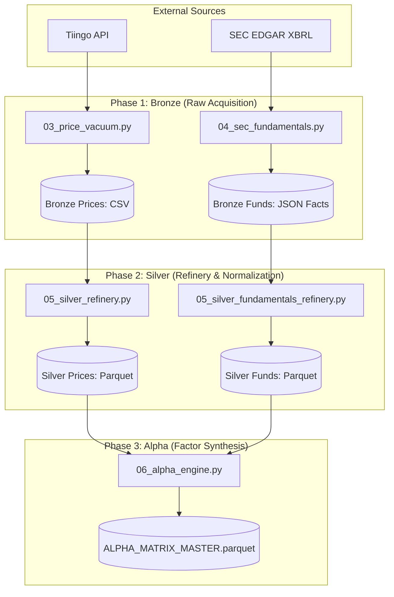

# 🏛️ SYSTEM ARCHITECTURE: SMID-SEC DATA ENGINE
**Author:** Quantitative Engineering Team  
**Standard:** Institutional-Grade Quant Infrastructure  
**Version:** 1.2 (CIK-Centric Evolution)

---

## 1. Executive Summary
The **SMID-SEC Data Engine** is a high-performance, point-in-time (PIT) financial data pipeline designed for the US Small & Mid-Cap (SMID) universe. Unlike standard retail datasets, this engine is built from the ground up to be **Survivorship-Bias Free**, capturing delisted companies ("Ghosts") and aligning fundamental data strictly with official SEC filing dates (`filed_date`) to eliminate look-ahead bias.

---

## 2. Core Engineering Principles

### 🧪 A. Zero-Cheat Discipline (Point-in-Time)
A common failure in quantitative backtesting is using data that was not yet public at the simulation date. 
*   **Fundamental Lag:** We ignore the fiscal period end date for trading signals. We only use the `filed_date` (the day the 10-K/Q hit EDGAR).
*   **Price Split Correction:** We use `adjClose` for returns but `close` (raw) combined with `shares_outstanding` for Market Cap calculation to ensure structural integrity.

### 👻 B. Survivorship-Bias Free
Most APIs only provide data for currently active tickers. This engine:
1.  Scans the **SEC Ticker-to-CIK** master list (including defunct companies).
2.  Maps **Tiingo PermaTickers** (unique IDs that don't change if a company is bought or delisted).
3.  Maintains a `master_tracker.csv` that acts as the source of truth for the entire universe's history.

### 🆔 C. CIK-Centric Mapping
Tickers change (e.g., `FB` -> `META`). CIKs (Central Index Keys) do not.
*   The engine uses CIK as the primary key for joining Fundamentals (SEC) and Prices (Tiingo).
*   This prevents "data orphans" where a company exists in SEC records but is lost due to a ticker change in the price database.

---

## 3. Data Flow Architecture

---

## 4. Layer Specifications

### 🥉 The Bronze Layer (Storage: `bronze/`)
*   **Prices:** Raw daily CSVs. Each file contains 30+ years of OHLCV + Adjustments.
*   **Fundamentals:** Raw SEC JSON Facts. Contains the full history of GAAP tags (Revenues, NetIncome, etc.) for a single CIK.

### 🥈 The Silver Layer (Storage: `silver/`)
*   **Refinery Process:** Uses **Polars** and **PyArrow** for memory-efficient chunked processing.
*   **Normalization:** 
    *   Taxonomic Mapping: Maps ~50+ disparate SEC tags (e.g., `NetIncomeLoss`, `NetIncomeLossAvailableToCommonStockholdersBasic`) into a single normalized `net_income` field.
    *   CIK Extraction: Cleans and pads CIKs to 10 digits for perfect joining.
*   **Storage:** Compressed Parquet (`zstd`) for O(1) access times.

### 🥇 The Alpha Layer (Storage: `silver/alpha_matrix_master.parquet`)
The final product. A daily, ticker-date-indexed matrix containing:
*   **Value Factors:** P/E, P/B, EV/EBITDA, FCF Yield.
*   **Quality Factors:** ROE, ROA, Gross Margin, Debt-to-Equity.
*   **Momentum Factors:** 1M, 3M, 12M Returns.
*   **Risk Factors:** 30d/90d Realized Volatility.
*   **Liquidity:** 20-day Average Daily Volume (ADV).

---

## 5. Technical Stack
*   **Engine:** Python 3.12+
*   **Data Frame Engine:** [Polars](https://pola.rs/) (Rust-based, multithreaded)
*   **Storage Format:** Apache Parquet (Columnar storage)
*   **IO:** PyArrow for ultra-fast disk-to-memory transfers.
*   **Orchestration:** Custom `00_orchestrator.py` with auto-retry logic and registry synchronization.

---
*"In quantitative finance, the quality of the signal is a direct function of the purity of the data."*
